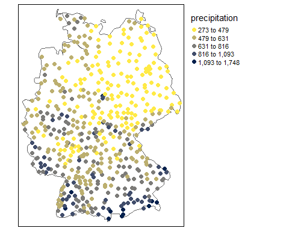
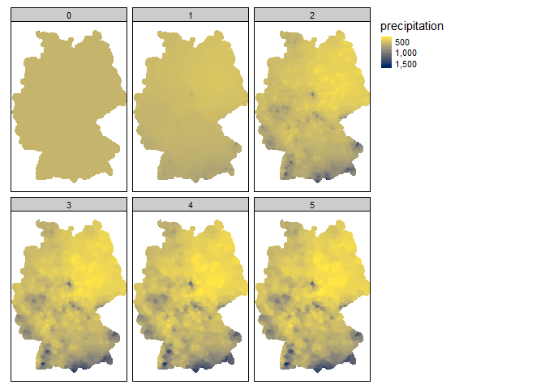
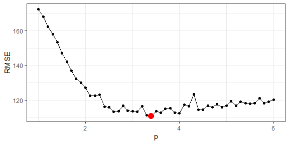

Inverse Distance Weighted (IDW) is a simple, nonparametic interpolation
method consisting on a weighted average of the observations based on the
distance (typically on a two-dimensional space for spatial processes).
It relies on the first law of geography, saying that all is related, but
near things are more related than distant things. Formally, it is
defined as (Bivand et al, 2008):

$$ \\hat{Z}(s\_0) = \\frac{\\sum^n\_{i=1} w(s\_i) Z(s\_i)}{\\sum^n\_{i=1}w(s\_i)} $$

where *Z* and *Ẑ* are the observed and estimated values of the
continuous spatial process, *s* is a location typically defined in a
two-dimensional space (*x*, *y*), and *w* are the weights defined as:

*w*(*s**i*) = ||*s**i* − *s*0|| − *p*

that is, the Euclidian distance between two locations at the power of
 − *p*. For *p* = 0, all observations will have the same weight no
matter the distance between the data point *s**i* and the
target point *s*0, while larger values for *p* will result in
giving larger relative weights to the nearest observations. We can tune
the value of *p* using out-of-sample methods such as cross-validation.
We can also limit the amount of neighbours to take into consideration to
speed up computations.

IDW is intuitive and quick to implement and it will always yield
estimated values ranging between
\[*m**i**n*(*Z**i*), *m**a**x*(*Z**i*)\]. However,
we obtain no estimate of the uncertainty associated with the
predictions, it offers a limited flexibility in terms of modelling the
correlation between observations based on distance, and ignores the
spatial disposition of the observations.

I’ll illustrate this method using precipitation data for Germany (in mm)
extracted from the NOAA API. This is the list of packages I will use:

    library("rnoaa") # Download meteo data from NOAA
    library("rnaturalearth") # Country boundaries
    library("gstat") # IDW function
    library("tmap")
    library("sf")
    library("tidyverse")

Preparing precipitation data
============================

Precipitation data (in mm) for Germany, 2018 will be obtained using the
beautiful [rnoaa package](https://github.com/ropensci/rnoaa) by
[ropensci](https://ropensci.org/). An API token can be freely obtained
as indicated in the package documentation.

    # Get location indicators for yearly data (GSOY) at the country level and get Germany
    locations <- ncdc_locs(datasetid='GSOY', locationcategoryid = "CNTRY",
                           token = api_key, limit = 1000)
    locations <- locations$data %>%
      filter(name %in% c("Germany"))
    # Get precipitation data
    meteodata <- ncdc(datasetid = "GSOY", 
                      datatypeid = "PRCP",
                      locationid = locations$id,
                      startdate = as.Date("2018-01-01"),
                      enddate = as.Date("2018-12-31"),
                      limit = 1000, 
                      token = api_key) %>%
      .$data
    # Get station data
    stationdata <- map_df(meteodata$station,
                          ~(ncdc_stations(datasetid='GSOY', stationid = .x, token = api_key)$data))
    stationdata$station <- meteodata$station
    # We merge the two tables
    precipdata <- inner_join(meteodata, stationdata, by = "station")
    # Rename precipitation variable
    precipdata <- rename(precipdata, precipitation = value)

We want to create geometries with `sf` to be able perform spatial
analysis. We also want to get country boundaries, included in the
[rnaturalearth](https://ropensci.org/tutorials/rnaturalearth_tutorial/)
package. We’ll use ETRS/UTM 31N CRS for Germany.

    # Create geometries
    precipdata <- st_as_sf(precipdata, coords = c("longitude", "latitude"), dim = "XY", crs = 4326) %>%
      st_transform(crs = 25831)
    # Germany polygon
    germany <- ne_countries(country = "germany", scale = "medium") %>%
      st_as_sf() %>%
      st_transform(crs = st_crs(precipdata))
    # Subset stations to Germany
    precipdata <- precipdata[st_intersects(precipdata, germany, sparse = FALSE),]

Now we are ready to do a cartographic representation of the data using
the `tmap` package.

    tm_shape(germany) +
        tm_borders() +
    tm_shape(precipdata) +
        tm_dots(col = "precipitation", style = "jenks", size = 0.25, n = 5, palette = "-cividis") +
    tm_layout(legend.outside = TRUE)

It appears that the NE of the country was much dried than the South in
2018.

Tuning p in IDW
===============

As mentioned above, *p* is the parameter that will determine the weights
based on the distance between the target location and the observed data.
The larger the *p*, the larger the relative weight of nearby
observations (with respect to the rest) will be. To illustrate this,
let’s compute IDW interpolations for a different range of *p* values.

    # We make 5km prediction grid
    grid_ger <- st_make_grid(germany, cellsize = 5000, what = "centers")
    # Function to perform IDW for a given p
    idw_p <- function(p){
      idwgrid <- idw(precipitation ~ 1, precipdata, grid_ger, idp = p) %>%
        rename(precipitation = var1.pred) %>%
        select(precipitation) %>% 
        mutate(p = p)
    }
    # Run IDW for a series of p, then join results
    idw_results <- 0:5 %>%
      map(~ idw_p(p = .x))
    idw_results <- do.call(what = sf:::rbind.sf, args = idw_results)

    # Make map with different p values
    tm_shape(germany) +
        tm_borders() +
    tm_shape(idw_results) +
        tm_dots(col = "precipitation", size = 0.25, palette = "-cividis", style = "cont") +
    tm_facets("p") +
    tm_layout(legend.outside = TRUE)

As the resulting maps show, the smaller the *p* parameter, the smoother
the resulting surface is, being the result of *p* = 0 a constant surface
equal to the precipitation average. A usual default for this parameter
is 2, although we can do some parameter search to guide the choice. To
do so, we can use the in-built functions in `gstat` and calculate `RMSE`
comparing the observed and predicted values.

    # Function to cross-validate IDW
    cv_idw <- function(p){
      # Define gstat object
      idw.gstat <- gstat(id = "precipitation", formula = precipitation ~ 1, data = precipdata, set = list(idp = p))
      # Perform CV
      cv <- gstat.cv(object = idw.gstat, nfold = 10)
      # Calculate RMSE
      res <- tibble(p = p, RMSE = sqrt(mean((cv$precipitation.pred - cv$observed)^2)))
      return(res)

    }
    # Let's cv for a range of p
    cv_res <- seq(1, 6, by = 0.1) %>%
      map_df(~ cv_idw(p = .x))

We represent the results graphically to see where the minimum RMSE is.

    # And plot results
    ggplot(cv_res, aes(x = p, y = RMSE)) +
      geom_point() +
      geom_line() +
      geom_point(data = filter(cv_res, RMSE == min(cv_res$RMSE)), colour = "red", size = 4) +
      theme_bw()

For these data, the value of *p* that minimises the RMSE is 3.4.
